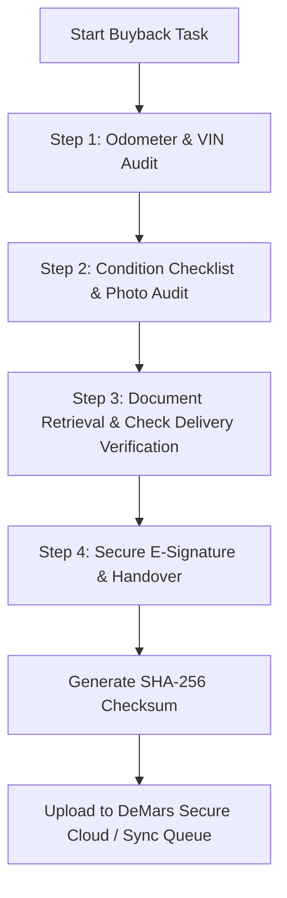
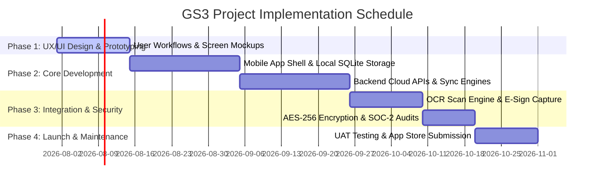

# PROJECT PROPOSAL & TECHNICAL APPROACH
## Secure Field Operations Mobile Platform ("DeMars FieldOps Link")

**Prepared For:** Kyle Morris, President & Owner  
**Organization:** DeMars & Associates LTD  
**Prepared By:** GS3 Solutions Technical Architecture Team  
**Focus:** On-Site Lemon Law Buybacks, Vehicle Inspection Audits, Document Exchange & E-Signatures  

---

### 1. Executive Summary
DeMars & Associates LTD, as a leading alternative dispute resolution (ADR) administrator, requires a comprehensive and highly secure mobile solution for on-site Transfer Agents (vehicle retitling specialists) who facilitate vehicle buybacks and warranty dispute resolutions. 

When a manufacturer agrees to buy back a consumer vehicle under state Lemon Law provisions, Transfer Agents are deployed to dealerships or residential sites to:
1. **Inspect the Vehicle:** Record mileage, check VIN identifiers, and document structural/cosmetic conditions.
2. **Execute Legal Documentation:** Retrieve, inspect, and sign vehicle titles, retitling forms, and power of attorney.
3. **Verify Monetary Exchange:** Securely log the exchange of the manufacturer buyback check.
4. **Communicate in Real-Time:** Synchronize progress logs and confirm procedures with DeMars headquarters.

**DeMars FieldOps Link** by GS3 Solutions is a custom, offline-first mobile application platform built specifically to support these high-integrity steps. The app replaces manual paper checklists and emails with a secure, automated workflow that captures digital proof, secures sensitive customer data, and guarantees data integrity using cryptographic hashing.

---

### 2. Core Mobile App Workflows

The application is structured around a step-by-step transaction wizard that guides the Transfer Agent through the buyback process:

#### A. Vehicle Detail & VIN Audit
*   **Camera-Based VIN Scanning:** Integrates on-device OCR (Optical Character Recognition) scanner to instantly capture and match the vehicle's VIN plate against the case records.
*   **Odometer Verification:** Agents input and take a verified, timestamped photo of the dashboard odometer to prevent dispute-resolution fraud.

#### B. Visual Condition Checklist
*   **Interactive Panel Checks:** Agents go through a checklist covering the vehicle's exterior panels, interior, tires, and number of key fobs handed over.
*   **High-Resolution Photo Log:** Mandatory capture of photos (all four angles, interior, dashboard, keys) with automatic geo-tagging and time-stamping embedded as metadata.

#### C. Legal Document Retrieval & Exchange
*   **Title Scan & Check Exchange:** Agents scan the vehicle title (front and back) to verify that ownership signatures are clear, liens are released, and power of attorney documents are correct.
*   **Check Verification:** Photographic proof of the manufacturer buyback check exchanged with the customer is uploaded to confirm delivery.

#### D. Secure E-Signature Handover
*   **Joint E-Signatures:** Capture signatures from both the customer and the Transfer Agent on-screen.
*   **Immutable Transaction Log:** Once signatures are captured, the transaction is marked as complete, and the record is digitally sealed.

---

### 3. Technical Architecture & Security Design

To maintain the highest standards of security and data integrity, GS3 Solutions proposes the following technical stack and security designs:

| Architectural Tier | Selected Technology Stack | Rationale |
| :--- | :--- | :--- |
| **Mobile Client** | React Native / Flutter | Offers cross-platform native performance (iOS & Android) with local SQLite databases for reliable storage. |
| **Backend API** | Node.js (NestJS) / Go (Golang) | High-performance, type-safe API gateways with native support for streaming audits. |
| **Data Encryption** | AES-256 (At-Rest) & TLS 1.3 (In-Transit) | Meets SOC-2 and ISO 27001 standards for protecting customer Personal Identifiable Information (PII). |
| **Database Tier** | PostgreSQL (Primary) / AWS S3 (Objects) | Highly structured databases with audit log schemas and secure media storage buckets. |

#### High-Integrity Security Features:
1. **Offline-First Architecture & Sync Queue:** Transfer Agents frequently operate in remote areas, metal dealership structures, or underground garages with zero cell coverage. The app stores all forms, photos, and signatures in a local SQLite database encrypted using SQLCipher. Once connection is restored, a secure sync manager uploads data in background chunks.
2. **Cryptographic Proof of Handover:** To guarantee that photos and signatures are not altered post-inspection, the app computes a local SHA-256 checksum of all form inputs, photos, and signature coordinates. This checksum is uploaded as a tamper-proof signature of the transaction.
3. **GPS Validation (Geofencing):** The application records GPS coordinates at the moment of e-signature, verifying that the transaction took place at the designated dealership or location.
4. **Agent-to-HQ Secure Messenger:** Encrypted chat stream allowing Transfer Agents to message administrators for real-time clearance if they encounter title discrepancies or payment issues.

---

### 4. Implementation Roadmap

GS3 Solutions proposes an agile 12-week development lifecycle to design, build, and deploy the application:

### 5. Maintenance & Support
*   **App Store Maintenance:** Updates for iOS and Android OS version upgrades to ensure backwards compatibility.
*   **Offline Data Resilience audits:** Scheduled checks to verify transaction sync queues and verify cryptographic checksum logs.
*   **24/7 Priority Support SLA:** Emergency hotline for Transfer Agents stuck in the field with buyback-blocking software issues.
